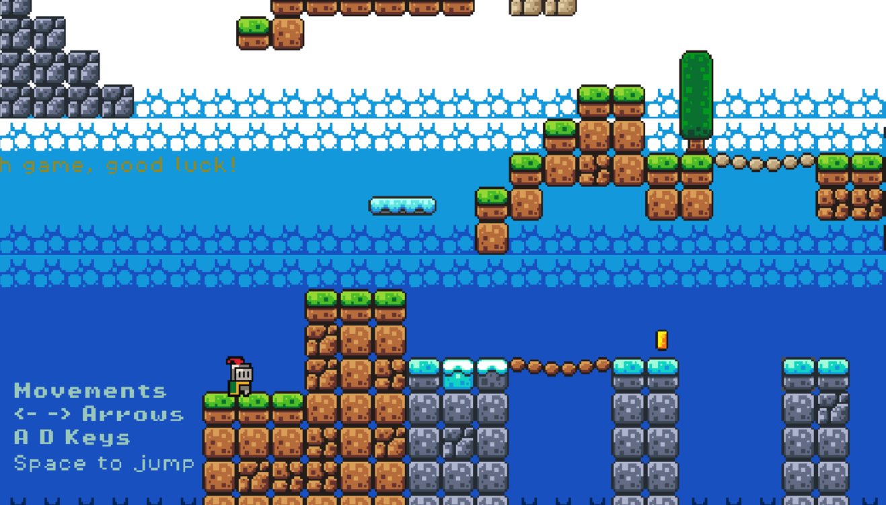
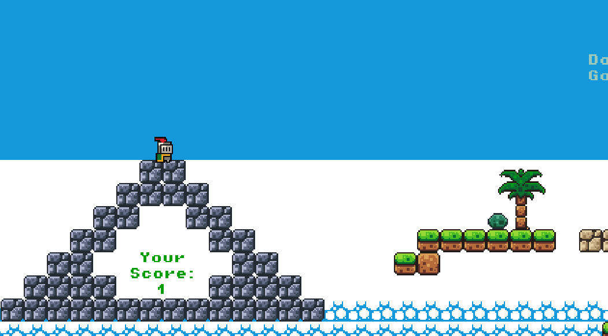

# 🎮 Pnight

A game developed using the [Godot Engine](https://godotengine.org/).  

## 🛠️ Built With

- **Godot Engine** version 4.4.1 – Free and open-source game engine
- GDScript 

## 🎯 Gameplay

Play as a broke but brave knight on a quest to collect coins scattered across dangerous lands — all to pay off a dragon and rescue a princess.

## 📸 Screenshots

  

## 🚀 Game is on website, enjoy: [Itchio](https://lussskki.itch.io/pnight)
## 🚀 Also is .exe executable for play, clone git and open Plat.exe

